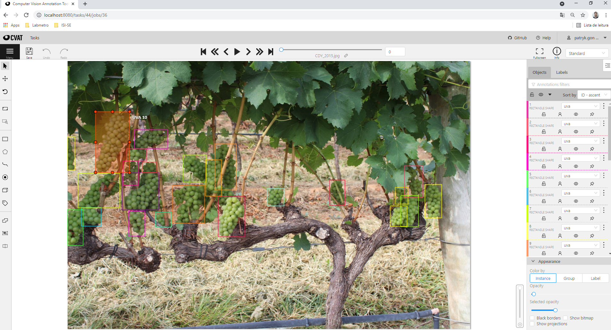
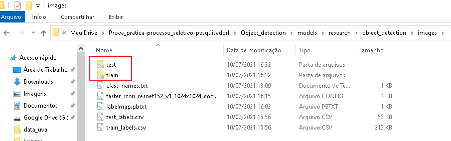
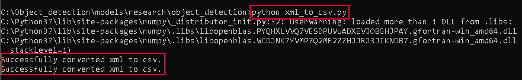
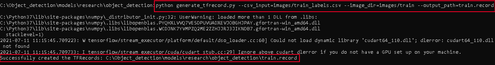
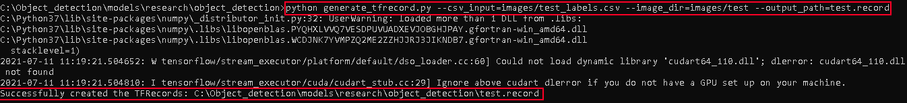
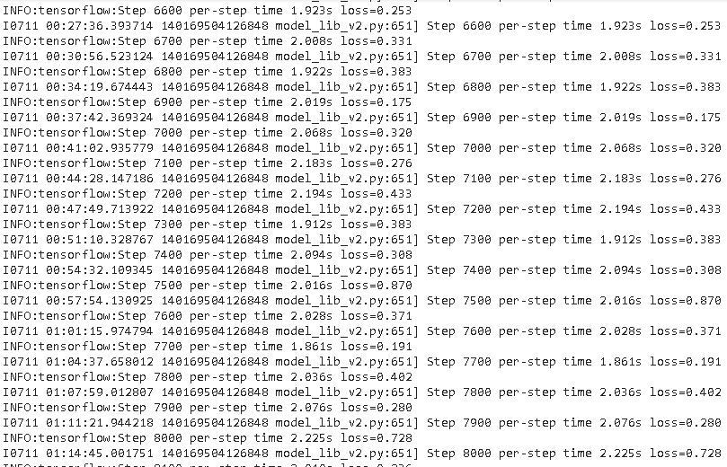
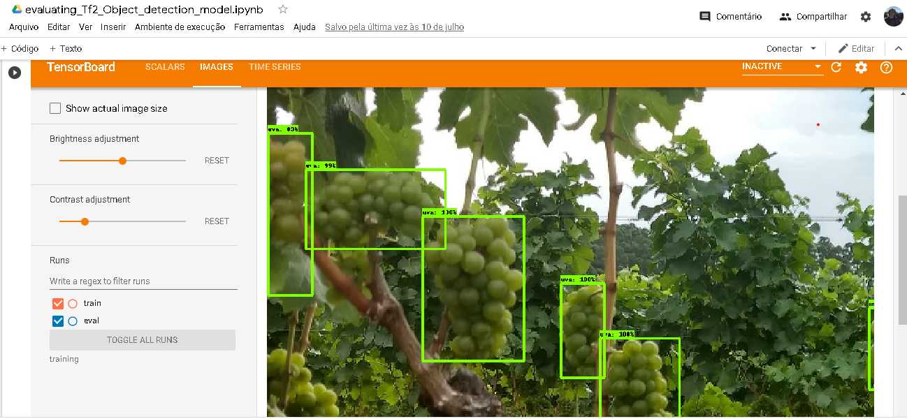

# Processo seletivo - Visão Computacional - Pesquisador I
Prova prática parte do processo seletivo para a vaga de pesquisador I em visão computacional.

Para resolver o problema proposto utilizei a API para detecção de objetos do tensorflow2. Este texto descreve de forma breve os passos seguidos para completar a tarefa.
O problema consiste em fazer a detecção de cachos de uva em imagens. O conjunte de imagens rotuladas foi disponibilizado pela banca avaliadora.

Este repositório contém:
- *xml_to_csv.py* - para gerar arquivos csv para as imagens de treino e teste.
- *generate_tfrecord.py* - para criar arquivos tfrecord para as imagens de treino e teste.
- *generate_labelmap.py* - para criar o arquivo labelmap para o detector de objetos.
- *test_labels.csv* - arquivo csv gerado com as imagens de teste.
- *train_labels.csv* - arquivo csv gerado com as imagens treino.
- *labelmap.pbtxt* - arquivo labelmap gerado.
- *test.record* - arquivo tfrecord gerado (teste).
- *train.record* - arquivo tfrecord gerado (treino).
- *faster_rcnn_resnet152_v1_1024x1024_coco17_tpu-8.config* - arquivo config do modelo utilizado com os parâmetros setados para o problema proposto.
- *training_Tf2_Object_detection_model.ipynb* - notebook para treinar o modelo no google colab.
- *evaluating_Tf2_Object_detection_model.ipynb* - notebook para avaliar o modelo no goole colab.
- *object_detection_grape_inferene.ipynb* - notebook para fazer inferência em imagens de teste com o modelo treinado.
- *saved_model.pb* - modelo salvo.

A seguir são descritos os passos seguidos para completar a tarefa:
1. Configurei o ambiente para o *Tensorflow2 Object Detection API*
2. Como próximo passo, analizei brevemente as imagens e seus rótulos utilizando o cvat(Computer Vision Annotation Tool)

  

3. Exportei o dataset no formato *pascal voc*.
4. Organizei os o dataset em treino e teste

  

5. Rodei o comando *python xml_to_csv.py* para gerar os arquivos csv para as imagens de treino e teste

  

6. Rodei o comando *python generate_tfrecord.py --csv_input=images/train_labels.csv --image_dir=images/train --output_path=train.record* para gerar o arquivo tfrecord (treino)

  

7. Rodei o comando *python generate_tfrecord.py --csv_input=images/test_labels.csv --image_dir=images/test --output_path=test.record* para gerar o arquivo tfrecord (teste)

  

8. Rodei o código *python generate_labelmap.py* para gerar o arquivo labelmap.pbtxt
9. Ajustei parâmetros no arquivo .config do modelo utilizado (faster_rcnn_resnet152_v1_1024x1024_coco17_tpu-8.config) 
10. Treinei o modelo utilizando o google colab (notebook disponibilizado no repositório *"training_Tf2_Object_detection_model.ipynb"*)
Abaixo pode ser vista uma imagem da saída do colab do modelo em treinamento

  

11. Avaliei o modelo no google colab (notebook disponibilizado no repositório *"evaluating_Tf2_Object_detection_model.ipynb"*)
A imagem abaixo mostra uma tela do TensorBoard durante uma etapa de avaliação 

  

12. Por fim o modelo treinado foi salvo e utilizado no notebook para inferência (*"object_detection_grape_inferene.ipynb"*)
Nas figuras abaixo pode-se ver a inferência em algumas imagens.

  

  

  

